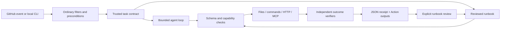

# Architecture

The action is an ordinary Node 24 JavaScript Action. Its bundled distribution is committed, so consumers do not run npm installation at job time. The same engine powers the local CLI and importable `dist/index.js`. There is no Flock server, implicit telemetry, account, global agent memory, or background job.

## Trusted control, untrusted observations

Task JSON controls providers, budgets, capabilities, credentials and verifiers. Tool responses and `inputs` are observations. A system instruction labels that distinction, while tool schemas and capability selection enforce a narrower authority boundary regardless of what the model says.

The provider can select a declared tool and JSON arguments; it cannot add tools, extend budgets, change verification, or inject a shell command through argv. `finish` is a structured submission to verification. Failed checks can cause another reasoning turn; reaching a cap fails the run. A finish message without verifiers stays unverified.

## One receipt format

Each receipt contains task/input digests, mode, status, timings, token/cost estimates, a redacted structured result, executed arguments and output digests, and verifier results. Raw tool outputs and model transcripts are not persisted. A canonical SHA-256 checksum detects accidental modification. It is **not** an attestation, signature or protection against an attacker who can rewrite the receipt and recompute the checksum.

## Promotion has a deliberately narrow contract

Promotion exports successful steps, requires explicit review, fingerprints the task and inputs, and guards read observations. It refuses read-after-write traces, unverified results, changed contracts, redacted traces and context-only observations. Replay validates the entire plan before execution and does not construct a model provider.

This creates a measurable local property: eligible repeated operations use zero inference while running their outcome checks again. It does not prove that a successful run generalizes to a task family. Parameter substitution, branching, recovery, signed publication, fleet policy, cross-run optimization and rollbacks need distinct designs and evidence.

## Existing systems remain in charge

Use GitHub for triggers, concurrency, scheduling, artifacts, reusable workflows and approval. Use provider/gateway limits for hard billing ceilings. Use job/container/network boundaries for isolation. Use established deterministic actions for build, deploy and publish. Use Flock for judgment and for reviewing the transition back to deterministic automation.
